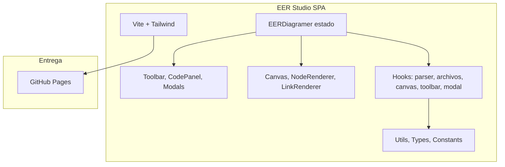

# 🎨 dbv-eer-studio

[](https://davidbuenov.github.io/dbv-eer-studio/)

**Editor de Diagramas Entidad-Relación Extendido (EER), Modelo Relacional y SQL DDL (Web & Escritorio Nativo)**

`dbv-eer-studio` es una suite docente multiplataforma (Web + App Nativa de Escritorio con Tauri v2) para crear y editar diagramas Entidad-Relación Extendido mediante un lenguaje específico de dominio (DSL) simple e intuitivo.


## 🆕 Novedades - Versión 1.2.0

- 🖥️ **Escritorio nativo con Tauri v2** - `dbv-eer-studio` ya se distribuye como aplicación de escritorio nativa para Windows (instalador MSI y NSIS), manteniendo la versión web intacta.
- 🐛 **Correcciones específicas del ejecutable nativo** - Zoom con Ctrl+rueda/Ctrl+±, arrastre fluido de tablas en el Modelo Relacional, e icono propio de la app.
- ✅ **Suite de pruebas unitarias** - Cobertura de los 9 pasos formales de conversión EER → Relacional y del generador de SQL DDL con Vitest.
- 🏷️ **Repositorio renombrado** a `dbv-eer-studio`.

## 🆕 Novedades - Versión 1.1.0

- ✨ **Deselección automática al editar código** - Cuando haces focus en el editor de código, se deselecciona automáticamente cualquier nodo. Esto evita eliminar accidentalmente un elemento al pulsar Delete mientras editas.
- 🎯 **Mover atributos con entidades (Shift+Drag)** - Presiona Shift mientras arrastras una entidad para mover también sus atributos, manteniendo la distancia relativa. Perfecto para reorganizar grupos de elementos sin perder el diseño.
- 📐 **Prompt mejorado para IA** - Actualizado con guía detallada de espaciado, límite de caracteres (≤15) y ejemplos completos para generar diagramas limpios y sin solapamientos.
- 💡 **Instrucción visual en la barra de herramientas** - Nuevo tooltip que explica cómo usar Shift+Drag para mover atributos junto con sus entidades.

## 🛠️ Resumen de la refactorización 2025

- Refactor completado en 7 fases (dic 2025) con separación total de responsabilidades.
- Componentes creados: Canvas + Node/LinkRenderer, Toolbar, CodePanel y 5 modales reutilizables.
- Hooks dedicados para parser, archivos, canvas, toolbar y modales.
- EERDiagramer.tsx reducido de 749 → 445 líneas; renderers y toolbar optimizados con `React.memo` y handlers con `useCallback`.

## 🏗️ Arquitectura




## ✨ Características

### Edición Visual e Interactiva
- 🎨 **Barra de herramientas visual** - inserta elementos con un simple clic en el canvas
- 🖱️ **Modales de configuración** - define propiedades de entidades, relaciones y atributos mediante formularios intuitivos
- 🎯 **Inserción por coordenadas** - haz clic donde quieras colocar un elemento y configúralo visualmente
- 🔄 **Edición bidireccional** - arrastra nodos en el canvas y el código se actualiza automáticamente
- 🗑️ **Eliminación de nodos** - selecciona cualquier nodo (clic) y pulsa Delete para eliminarlo con confirmación
- 📐 **Panel redimensionable** - ajusta el tamaño del editor de código arrastrando la línea divisoria
- 🔍 **Zoom avanzado** - controles +/−, reset, y ajuste automático al contenido (fit-to-content)
- 🧹 **Limpiar con confirmación** - limpia todo el código con modal de seguridad
- 📋 **Dropdowns ordenados alfabéticamente** - encuentra entidades fácilmente en los formularios

### Código y Diagramas
- 📝 **Editor de código DSL** con sintaxis simple para definir entidades, relaciones y atributos
- 🎯 **Visualización en tiempo real** del diagrama EER
- 💾 **Guardar/Abrir archivos `.eer`** con File System Access API (navegadores modernos) y fallback compatible
- 📤 **Exportar a SVG** - descarga tus diagramas en formato vectorial
- 🔍 **Zoom y paneo** para trabajar con diagramas grandes

### IA y Recursos
- 🤖 **Prompt integrado para IA** - genera código EER usando ChatGPT, Claude o Gemini
- 📚 **Guía de sintaxis integrada** con ejemplos y referencia completa
- 📁 **Ejemplos incluidos** - archivos `.eer` de muestra en la carpeta `ejemplos/`

### Diseño y Compatibilidad
- 🎨 **Interfaz moderna** diseñada con Tailwind CSS
- 🌐 **Compatible con navegadores modernos**
- ⚡ **Sin alertas del sistema** - toda la interacción mediante modales personalizados

## 🌐 Demo en vivo y ejemplos

Puedes probar la aplicación ya desplegada en GitHub Pages:

https://davidbuenov.github.io/dbv-eer-studio/

### Video de demostración

[](https://youtu.be/oFJYiJw_kRE)

Haz clic en la imagen para ver el vídeo completo en YouTube.

Además, el repositorio incluye una carpeta `ejemplos/` con varios ficheros de ejemplo con extensión `.eer` que puedes abrir directamente en la app (File → Open) para ver diagramas de muestra y editar.

### Ejemplos incluidos

Los siguientes ficheros ya están disponibles en la carpeta `ejemplos/`:

- `ejemplos/202511ER_Hotel.eer` — Caso de estudio: **HOTELES ROYAL UMA** (habitaciones, servicios, personal y reservas). Ábrelo en la app para ver un diagrama completo.
- `ejemplos/Prompt_para_crear_gems.md` — Prompt optimizado para usar con IAs (ChatGPT, Claude, Gemini) y generar código EER Studio desde descripciones en lenguaje natural.

> 💡 **Tip**: Usa el prompt incluido en la carpeta `ejemplos/` para que la IA genere diagramas EER perfectamente formateados para esta herramienta.


## 🚀 Características EER Soportadas

- ✅ Entidades fuertes y débiles
- ✅ Relaciones normales e identificativas
- ✅ Atributos: simples, clave, derivados y multivaluados
- ✅ Cardinalidades (1, N, M) y participación total
- ✅ Jerarquías de especialización/generalización (disjuntas y solapadas)
- ✅ Uniones/Categorías
- ✅ Posicionamiento manual con coordenadas persistentes

## 📦 Instalación

### Prerrequisitos

- [Node.js](https://nodejs.org/) (versión 18 o superior)
- npm (incluido con Node.js)

### Pasos

1. **Clona el repositorio:**

```bash
git clone https://github.com/davidbuenov/dbv-eer-studio.git
cd dbv-eer-studio

```

2. **Instala las dependencias:**

```bash
npm install
```

3. **Inicia el servidor de desarrollo:**

```bash
npm run dev
```

4. **Abre tu navegador:**

Navega a [http://localhost:5173](http://localhost:5173) (o el puerto que muestre la terminal)

## 🏗️ Build para Producción

Para generar una versión optimizada para producción:

```bash
npm run build
```

Los archivos generados estarán en la carpeta `dist/`. Puedes servirlos con cualquier servidor web estático.

## 🖥️ Aplicación de Escritorio Nativa (Tauri v2)

Además de la versión web, `dbv-eer-studio` se distribuye como aplicación de escritorio nativa (Windows, con soporte de macOS/Linux vía Tauri v2).

### Prerrequisitos adicionales

- [Rust](https://www.rust-lang.org/tools/install) y Cargo
- En Windows, el [WebView2 Runtime](https://developer.microsoft.com/microsoft-edge/webview2/) (viene preinstalado en Windows 11)

### Ejecutar en modo desarrollo

```bash
npm run desktop:dev
```

### Generar el instalador de producción

```bash
npm run desktop:build
```

Genera el ejecutable y los instaladores (`.msi` y `-setup.exe` en Windows) en `src-tauri/target/release/` y `src-tauri/target/release/bundle/`.

## ✅ Tests

El motor de conversión EER → Relacional (9 pasos) y el generador de SQL DDL tienen cobertura de pruebas unitarias con [Vitest](https://vitest.dev/):

```bash
npm run test
```

## ▶️ Scripts de arranque rápido

Alternativa a `npm run dev` para arrancar/parar el servidor de desarrollo con un solo comando:

| Plataforma | Iniciar | Detener |
| --- | --- | --- |
| Windows | `start.cmd` | `stop.cmd` |
| macOS / Linux | `./start.sh` | `./stop.sh` |

Para previsualizar el build:

```bash
npm run preview
## 🌍 Publicación en GitHub Pages

Este proyecto está preparado para desplegarse automáticamente en **GitHub Pages** usando una *GitHub Action* incluida en `.github/workflows/deploy-pages.yml`.

### Cómo funciona

1. Cada push a la rama `main` ejecuta la acción.
2. Se hace build con `npm run build` (la Action fija `VITE_BASE=/dbv-eer-studio/`; en local, `vite.config.ts` usa `./` por defecto para que también funcione empaquetado en Tauri).
3. El contenido de `dist/` se publica en GitHub Pages.
4. La URL final será: `https://davidbuenov.github.io/dbv-eer-studio/`.

### Activar GitHub Pages

1. Ve a Settings → Pages en el repositorio.
2. Verifica que la fuente (source) esté en "GitHub Actions" (debería aparecer automáticamente tras el primer deploy).

### Personalizar dominio (Opcional)

Si quieres usar un dominio propio:
1. Crea un archivo `CNAME` dentro de `dist/` en tiempo de build (puedes añadir un paso en la acción o un script).
2. Apunta tu DNS (registro CNAME) al dominio `davidbuenov.github.io`.

Ejemplo de paso adicional en el workflow:

```yaml
			- name: Add CNAME
				run: echo "mi-dominio.com" > dist/CNAME
```

### Deploy manual (alternativa)

Si prefieres hacerlo manual sin Actions:
```bash
npm run build
git checkout --orphan gh-pages
git --work-tree dist add --all
git --work-tree dist commit -m "Deploy"
git push origin gh-pages --force
git checkout main
```

## 🔐 Seguridad

Este proyecto no envía datos a servidores externos. Los archivos `.eer` solo se manejan localmente en tu navegador. Usa navegadores modernos para aprovechar la File System Access API.

```

## 📖 Uso

### Modo Visual: Inserción con Barra de Herramientas

1. **Selecciona una herramienta** en la barra superior (Entidad, Relación, Atributo, etc.)
2. **Haz clic en el canvas** donde quieras colocar el elemento
3. **Completa el modal** con las propiedades:
   - **Entidades**: nombre
   - **Relaciones**: nombre, entidades a conectar, cardinalidades (1, N, M), participación total
   - **Atributos**: nombre, tipo (simple, clave, derivado, multivaluado), entidad a conectar
   - **Especialización**: tipo (disjunta/solapada), superclase, subclases
   - **Unión**: nombre, superclases, categoría
4. **Confirma** - el código se genera automáticamente con las coordenadas del clic

### Modo Código: Sintaxis Básica del DSL

```javascript
// Entidades
ent EMPLEADO (400, 300)
ent DEPARTAMENTO (700, 300)
weak_ent DEPENDIENTE (100, 300)

// Atributos
key_att DNI -> EMPLEADO (350, 220)
att Nombre -> EMPLEADO (450, 220)
derived_att Edad -> EMPLEADO (400, 180)
multivalued_att Telefono -> EMPLEADO (300, 250)

// Relaciones
rel TRABAJA_EN (550, 300)
link EMPLEADO TRABAJA_EN "N" [total]
link DEPARTAMENTO TRABAJA_EN "1"

// Relación Identificativa
ident_rel TIENE_DEP (250, 300)
link EMPLEADO TIENE_DEP "1"
link DEPENDIENTE TIENE_DEP "N" [total]

// Jerarquías (Especialización/Generalización)
spec d -> EMPLEADO (400, 420)
ent SECRETARIA (280, 550)
ent INGENIERO (520, 550)
link d SECRETARIA
link d INGENIERO

// Uniones/Categorías
union u (300, 750)
ent PERSONA (100, 650)
ent BANCO (300, 650)
link PERSONA u
link BANCO u
ent PROPIETARIO (300, 850)
link u PROPIETARIO [total]
```

### Edición Interactiva

- **Arrastra nodos**: Las coordenadas en el código se actualizan automáticamente
- **Edita el código**: El diagrama se regenera en tiempo real
- **Limpia todo**: Usa el botón "Limpiar" (con confirmación de seguridad)
- **Zoom/Pan**: Controles en la esquina inferior derecha del canvas

### Generación con IA

1. Haz clic en **"Prompt para tu IA"** en la barra superior
2. Copia el prompt proporcionado
3. Pégalo en ChatGPT, Claude, Gemini u otra IA
4. Describe tu problema de base de datos
5. Copia el código generado
6. Pégalo en el editor de EER Studio

### Guardar y Abrir Archivos

- **File → Open**: Abre un archivo `.eer` existente
- **File → Save**: Guarda en el archivo actual (o solicita ubicación si es nuevo)
- **File → Save as**: Guarda con un nuevo nombre/ubicación

## 🛠️ Tecnologías

- **React 19** - Framework UI
- **TypeScript** - Tipado estático
- **Vite** - Build tool y dev server
- **Tailwind CSS** - Estilos
- **Lucide React** - Iconos
- **File System Access API** - Gestión de archivos

## 📝 Scripts Disponibles

- `npm run dev` - Inicia el servidor de desarrollo
- `npm run build` - Genera el build de producción
- `npm run preview` - Previsualiza el build de producción
- `npm run lint` - Ejecuta el linter

## 🤝 Contribuciones

Las contribuciones son bienvenidas. Por favor:

1. Haz fork del repositorio
2. Crea una rama para tu feature (`git checkout -b feature/AmazingFeature`)
3. Commit tus cambios (`git commit -m 'Add some AmazingFeature'`)
4. Push a la rama (`git push origin feature/AmazingFeature`)
5. Abre un Pull Request

## 📄 Licencia

Este proyecto está bajo licencia MIT. Ver el archivo `LICENSE` para más detalles.

## 👨‍💻 Autor

**David Bueno Vallejo**
- Website: [davidbuenov.com](https://davidbuenov.com/)
- GitHub: [@davidbuenov](https://github.com/davidbuenov)

## 🙏 Agradecimientos y Referencias Académicas

Este proyecto y su suite de conversión formal de 9 pasos han sido implementados siguiendo las propuestas didácticas y algoritmos de transformación del libro de referencia académica:
- **"Fundamentos de Sistemas de Bases de Datos"** (*Fundamentals of Database Systems*), por **Ramez Elmasri** y **Shamkant B. Navathe**.

Desarrollado con la asistencia de:
- **Gemini** & **Antigravity** - Google DeepMind AI
- **dbv-specs-ops** - Framework SDD por David Bueno Vallejo


---

⭐ Si te resulta útil este proyecto, ¡dale una estrella en GitHub!
