# DBV EER Studio

**🇪🇸 Español · [🇬🇧 English](./README.en.md)**

[](https://github.com/davidbuenov/dbv-eer-studio/releases)
[](https://davidbuenov.github.io/dbv-eer-studio/)


[](https://github.com/davidbuenov/dbv-eer-studio/commits/main)
[](https://github.com/davidbuenov/dbv-specs-ops)

> Suite docente de bases de datos: diseña diagramas **Entidad-Relación Extendido (EER)**, conviértelos al **Modelo Relacional** aplicando los 9 pasos formales y exporta el **SQL DDL** listo para ejecutar. Disponible como aplicación web y de escritorio nativa.

**[🌐 Probar la versión web (sin instalar nada)](https://davidbuenov.github.io/dbv-eer-studio/)**

[](https://youtu.be/oFJYiJw_kRE)

*Haz clic en la imagen para ver el vídeo completo en YouTube.*

---

## 📑 Índice

- [Descárgalo e instálalo](#-descárgalo-e-instálalo)
  - [Windows](#-windows)
  - [Linux](#-linux)
  - [macOS](#-macos)
  - [Navegador](#-navegador-sin-instalación)
- [Sobre el proyecto](#-sobre-el-proyecto)
- [Características principales](#-características-principales)
- [Los 9 pasos formales](#-los-9-pasos-formales)
- [Sintaxis del DSL](#-sintaxis-del-dsl)
- [Ejemplos incluidos](#-ejemplos-incluidos)
- [Para desarrolladores](#-para-desarrolladores)
- [Estructura del proyecto](#-estructura-del-proyecto)
- [Changelog](#-changelog)
- [Licencia](#-licencia)
- [Autor y créditos](#-autor-y-créditos)

---

## 🚀 Descárgalo e instálalo

**No necesitas instalar Node.js, Rust ni ninguna herramienta de programación.** El instalador de **DBV EER Studio** trae todo lo necesario, incluido el motor de renderizado del sistema.

> ¿Solo quieres probarlo? La [versión web](https://davidbuenov.github.io/dbv-eer-studio/) es la misma aplicación y no requiere instalación.

### 🪟 Windows

#### 1️⃣ Descarga

**[⬇️ Ver todas las versiones (Releases)](https://github.com/davidbuenov/dbv-eer-studio/releases)**

Descarga uno de los dos instaladores de la última versión:

| Archivo | Cuándo usarlo |
| --- | --- |
| `dbv-eer-studio_x.y.z_x64-setup.exe` | **Recomendado.** Instalador NSIS, no requiere permisos de administrador (se instala solo para tu usuario). |
| `dbv-eer-studio_x.y.z_x64_en-US.msi` | Paquete MSI, útil para despliegue en aulas o entornos corporativos con directivas de grupo. |

El navegador puede avisar de que el archivo "no se descarga habitualmente" o "no es de confianza" (SmartScreen de Microsoft Edge/Chrome). Es normal en instaladores nuevos y sin firma comercial: en Edge, abre el panel de descargas y pulsa **Mostrar más → Mantener** (o **Conservar de todos modos**).

#### 2️⃣ Instala

Haz doble clic sobre el instalador descargado. Windows puede mostrar un aviso de "Editor no reconocido" al ejecutarlo — pulsa **Más información → Ejecutar de todas formas**.

#### 3️⃣ Actualiza

A partir de aquí ya no necesitas volver a esta página para cada versión nueva. Abre el panel **Créditos** (barra superior) y pulsa **Buscar actualizaciones**. La comprobación es siempre bajo demanda — nunca se ejecuta sola al arrancar.

- Si ya tienes la última versión: **"Ya tienes la última versión."**
- Si hay una nueva: el botón cambia a **Instalar actualización** — un clic descarga, instala y reinicia la app por ti, sin pasar por el navegador ni por Releases.

### 🐧 Linux

**[⬇️ Descarga el `.deb`, el `.AppImage` o el `.rpm` desde Releases](https://github.com/davidbuenov/dbv-eer-studio/releases)** — se generan automáticamente en cada versión vía CI.

- **`.deb` (Debian, Ubuntu, Linux Mint y derivadas):** `sudo dpkg -i dbv-eer-studio_x.y.z_amd64.deb`, o doble clic desde el gestor de archivos.
- **`.rpm` (Fedora, openSUSE, RHEL y derivadas):** `sudo rpm -i dbv-eer-studio-x.y.z-1.x86_64.rpm`.
- **`.AppImage` (cualquier distribución):** dale permisos de ejecución (`chmod +x dbv-eer-studio_x.y.z_amd64.AppImage`) y ejecútalo directamente. Es portátil y no requiere instalación.

> **Nota honesta:** estos paquetes los compila la CI en cada versión, pero **todavía no se han probado en una máquina Linux real** — el desarrollo y las pruebas manuales se han hecho en Windows. Si encuentras un problema, [abre un issue](https://github.com/davidbuenov/dbv-eer-studio/issues); es justo el tipo de reporte que hace falta.

### 🍎 macOS

**[⬇️ Descarga el `.dmg` desde Releases](https://github.com/davidbuenov/dbv-eer-studio/releases)** — `dbv-eer-studio_x.y.z_universal.dmg`, universal (Apple Silicon + Intel), generado automáticamente vía CI.

No está firmado ni notarizado: la firma y notarización de Apple requieren una cuenta de pago (Apple Developer Program, 99 $/año) que este proyecto no usa, así que macOS lo bloqueará la primera vez ("no se puede abrir porque su desarrollador no puede verificarse"). Para abrirlo:

- Clic derecho (o `Ctrl` + clic) sobre `DBV EER Studio.app` → **Abrir** → confirmar en el diálogo. Solo hace falta la primera vez.
- O, desde la Terminal: `xattr -cr "DBV EER Studio.app"` antes de abrirlo.

> **Nota honesta:** igual que en Linux, el `.dmg` lo genera la CI pero **no se ha podido probar en un Mac real** todavía. El menú nativo de macOS (App/Archivo/Edición/Ventana/Ayuda) está implementado y compila, pero no se ha verificado en ejecución.

Si prefieres compilar tu propio ejecutable:

```bash
git clone https://github.com/davidbuenov/dbv-eer-studio.git
cd dbv-eer-studio
npm install
npm run desktop:build
```

Requiere Xcode Command Line Tools (`xcode-select --install`), [Rust](https://rustup.rs/) y Node.js 18+ — ver [Para desarrolladores](#-para-desarrolladores).

### 🌐 Navegador (sin instalación)

**[Abrir DBV EER Studio en el navegador](https://davidbuenov.github.io/dbv-eer-studio/)**

Es la misma aplicación, 100 % en el cliente: nada se sube a ningún servidor. Guardar y abrir archivos `.eer` funciona mediante la File System Access API en navegadores modernos (Chrome, Edge), con un fallback de descarga/subida en el resto.

---

## 📌 Sobre el proyecto

**DBV EER Studio** es una suite docente para asignaturas de **Bases de Datos**. Cubre el recorrido completo que se enseña en clase, con la particularidad de que **explica cada paso en vez de limitarse a dar el resultado**:

```text
Diagrama EER  ──►  Modelo Relacional  ──►  SQL DDL
 (conceptual)        (lógico, 9 pasos)      (físico, multi-SGBD)
```

Implementa el algoritmo de los **9 pasos formales** expuesto en *"Fundamentos de Sistemas de Bases de Datos"* de **Ramez Elmasri** y **Shamkant B. Navathe**, la referencia habitual en la universidad española. Cada tabla y cada clave ajena generada indica **qué regla la produjo y por qué**, para que el alumno pueda seguir el razonamiento en lugar de confiar en una caja negra.

**Construido con:**

- **Frontend:** React 19 + TypeScript (modo estricto) + Vite + Tailwind CSS.
- **Escritorio:** Rust + Tauri v2 (motor de renderizado nativo del sistema: WebView2 en Windows, WebKitGTK en Linux, WKWebView en macOS) — sin Electron.
- **Tests:** Vitest, cubriendo los 9 pasos de conversión y el generador de SQL.
- **Arquitectura:** 100 % cliente, sin backend ni telemetría. Tus diagramas no salen de tu equipo.



---

## ✨ Características principales

### Diseño del diagrama EER

- **Editor bidireccional DSL ↔ Canvas:** escribe el código y el diagrama se dibuja al instante; arrastra un nodo en el canvas y las coordenadas se actualizan solas en el código.
- **Barra de herramientas visual:** inserta entidades, relaciones y atributos con un clic en el canvas y configúralos mediante formularios, sin escribir una línea de DSL.
- **Notación de Chen completa:** entidades fuertes y débiles, relaciones normales e identificativas, atributos simples/clave/derivados/multivaluados, cardinalidades (1, N, M), participación total, jerarquías de especialización (disjuntas y solapadas) y uniones/categorías.
- **Shift + arrastrar** una entidad mueve también sus atributos, manteniendo la distancia relativa.
- **Zoom y paneo** con controles +/−, reinicio y ajuste automático al contenido.

### Conversión al Modelo Relacional

- **Motor de los 9 pasos formales** con trazabilidad completa: cada tabla, columna y clave ajena guarda qué paso la generó.
- **Inspector pedagógico:** el botón "Guía 9 Pasos" abre el resumen teórico del algoritmo, y cada tarjeta de tabla enlaza con la explicación concreta de la regla que la creó.
- **Editor relacional propio:** el Modelo Relacional tiene su propio DSL de texto, también bidireccional y con coordenadas persistentes.
- **Resaltado interactivo:** al pasar el ratón por una tabla se destacan sus conexiones de integridad referencial.

### Exportación

- **SQL DDL multi-SGBD:** Oracle SQL (dialecto principal en el ámbito universitario), PostgreSQL, MySQL, SQLite y ANSI SQL, con `CONSTRAINT`, tipos adaptados a cada dialecto y comentarios que explican la regla aplicada.
- **SVG vectorial** tanto del diagrama EER como del Modelo Relacional, listo para incrustar en una memoria o un TFG.
- **Archivos `.eer`** que guardan el diagrama y las coordenadas de ambas vistas.

### Interfaz

- **Español e inglés**, conmutables desde la cabecera; el idioma elegido se recuerda.
- **Prompt integrado para IA:** copia un prompt optimizado para que ChatGPT, Claude o Gemini generen el DSL a partir de un enunciado en lenguaje natural.
- **Guía de sintaxis integrada** con referencia completa de ambos DSL.
- **Fijar ventana encima** (solo escritorio) para mantener el diagrama visible junto a otra aplicación.

---

## 🎓 Los 9 pasos formales

| Paso | Regla | Resultado |
| --- | --- | --- |
| **1** | Entidades fuertes | Una tabla por entidad, con su clave primaria |
| **2** | Entidades débiles | Tabla con PK compuesta: FK del propietario + clave parcial (`ON DELETE CASCADE`) |
| **3** | Relaciones 1:1 | FK propagada al lado de participación total, con restricción `UNIQUE` |
| **4** | Relaciones 1:N | FK propagada del lado 1 al lado N; los atributos de la relación migran al lado N |
| **5** | Relaciones M:N | Tabla puente cuya PK combina las FKs de ambas entidades |
| **6** | Atributos multivaluados | Tabla independiente, para no violar la 1FN |
| **7** | Relaciones n-arias (n > 2) | Tabla de n vías; la PK combina las FKs de las entidades sin cardinalidad 1 |
| **8** | Especialización / generalización | Opciones 8A–8D de mapeo de herencia |
| **9** | Categorías (tipos de unión) | Tabla de categoría con clave sustituta |

La especificación formal completa está en [`dbv-specs-ops/docs/eer-to-relational-mapping.md`](./dbv-specs-ops/docs/eer-to-relational-mapping.md).

---

## ⌨️ Sintaxis del DSL

Referencia rápida — la guía completa está integrada en la app (botón **Sintaxis**).

```text
// Entidades
ent EMPLEADO (400, 300)
weak_ent DEPENDIENTE (100, 300)

// Atributos
key_att DNI -> EMPLEADO (350, 220)
att Nombre -> EMPLEADO (450, 220)
derived_att Edad -> EMPLEADO (400, 180)
multivalued_att Telefono -> EMPLEADO (300, 180)

// Relaciones y conexiones
rel TRABAJA_PARA (550, 300)
link EMPLEADO TRABAJA_PARA "N"
link DEPARTAMENTO TRABAJA_PARA "1"

// Entidad débil y relación identificativa
ident_rel TIENE_DEP (250, 300)
link EMPLEADO TIENE_DEP "1"
link DEPENDIENTE TIENE_DEP "N" [total]

// Jerarquías
spec d -> EMPLEADO      // 'd' disjunta, 'o' solapada
link d INGENIERO

// Categorías
union u
link PERSONA u
link u PROPIETARIO
```

Las coordenadas `(x, y)` son opcionales: si las omites, la app coloca el elemento automáticamente y escribe las coordenadas en cuanto lo arrastres.

---

## 📁 Ejemplos incluidos

La carpeta [`ejemplos/`](ejemplos/) contiene ficheros listos para abrir desde la app (**File → Open**):

- **[`202511ER_Hotel.eer`](ejemplos/202511ER_Hotel.eer)** — Caso de estudio *HOTELES ROYAL UMA*: habitaciones, servicios, personal y reservas. Un diagrama completo con entidades débiles, jerarquías y relaciones M:N para ver la conversión en un caso realista.
- **[`Prompt_para_crear_gems.md`](ejemplos/Prompt_para_crear_gems.md)** — Prompt optimizado para generar el DSL con una IA a partir de un enunciado en lenguaje natural.

> 💡 **Para docentes:** el prompt de la carpeta `ejemplos/` permite convertir los enunciados de prácticas en diagramas listos para que el alumno los revise y corrija — un buen punto de partida para ejercicios de "encuentra el error en el modelo".

---

## 🧑‍💻 Para desarrolladores

Todo lo anterior es lo único que necesita un usuario normal. Lo siguiente solo aplica si quieres **modificar el código fuente o compilarlo tú mismo**.

### Requisitos

- **Node.js:** `v18+` y `npm`
- **Rust:** `rustc` y `cargo` ([rustup.rs](https://rustup.rs/)) — solo para la app de escritorio
- **Windows:** C++ Build Tools (MSVC) de Visual Studio y el [WebView2 Runtime](https://developer.microsoft.com/microsoft-edge/webview2/) (preinstalado en Windows 11)

### Ejecutar en modo desarrollo

Usa los scripts incluidos en la raíz del proyecto:

**Windows:**

```cmd
start.cmd
```

**macOS / Linux:**

```bash
./start.sh
```

O manualmente:

```bash
npm install
npm run dev            # Versión web en http://localhost:5173
npm run desktop:dev    # Aplicación de escritorio (Tauri)
```

Para detenerlo: `stop.cmd` (Windows) o `./stop.sh` (macOS/Linux).

### Compilar

```bash
npm run build            # Web → carpeta dist/ (cualquier servidor estático)
npm run desktop:build    # Escritorio → src-tauri/target/release/bundle/
```

### Tests y calidad

```bash
npm test        # Suite Vitest: 9 pasos de conversión + generador SQL
npm run lint    # ESLint
npx tsc -b      # Comprobación de tipos (TypeScript estricto)
```

### Publicar una nueva versión

1. Sube la versión **en los cuatro sitios a la vez** — `package.json`, `src-tauri/tauri.conf.json`, `src-tauri/Cargo.toml` y `src/components/ModalCredits.tsx` — y mueve la sección `[Sin publicar]` de [`dbv-specs-ops/CHANGELOG.md`](./dbv-specs-ops/CHANGELOG.md) a `[x.y.z] — fecha`.
2. `git commit`, `git tag vx.y.z`, `git push origin main --tags`.
3. Los tres workflows de `.github/workflows/` (`release-windows.yml`, `release-linux.yml`, `release-macos.yml`) compilan cada plataforma y suben los artefactos a la Release.
4. `deploy-pages.yml` publica la versión web en GitHub Pages.

La clave privada de firma del actualizador **no está en este repositorio** — la genera y custodia quien mantiene el proyecto (`npx tauri signer generate`).

### Metodología

El proyecto sigue **Spec-Driven Development** con el framework [dbv-specs-ops](https://github.com/davidbuenov/dbv-specs-ops). Toda la documentación de ingeniería vive en [`dbv-specs-ops/`](./dbv-specs-ops/): especificaciones, arquitectura, decisiones técnicas (ADRs) y backlog.

---

## 📂 Estructura del proyecto

```text
dbv-eer-studio/
├── src/                          # Aplicación React + TypeScript
│   ├── EERDiagramer.tsx          # Componente raíz: estado y pestañas
│   ├── components/               # Canvas, Toolbar, CodePanel y modales
│   │   ├── relational/           # Visor del Modelo Relacional e inspector de pasos
│   │   └── sql/                  # Vista previa y exportación de SQL DDL
│   ├── hooks/                    # Parser, archivos, canvas, toolbar, modales
│   ├── i18n/                     # Diccionarios ES/EN y contexto de idioma
│   ├── utils/
│   │   ├── parser.ts             # DSL EER → nodos/enlaces
│   │   ├── codeGenerator.ts      # Nodos/enlaces → DSL EER (par crítico del anterior)
│   │   └── relational/           # Motor de 9 pasos, SQL DDL, geometría y export SVG
│   └── types/                    # Modelos de dominio EER y relacional
├── src-tauri/                    # Código Rust y configuración de Tauri v2
├── .github/workflows/            # CI: release por plataforma + despliegue de Pages
├── ejemplos/                     # Diagramas .eer de muestra y prompt para IA
├── dbv-specs-ops/                # Especificaciones SDD y marco de ingeniería
│   ├── docs/                     # SPECIFICATIONS, ARCHITECTURE, DESIGN, 9 pasos
│   ├── task.md                   # Backlog y snapshot de estado
│   ├── memory.md                 # Decisiones de arquitectura (ADRs)
│   └── CHANGELOG.md              # Historial de versiones
├── start.cmd / stop.cmd          # Scripts de ejecución en Windows
├── start.sh / stop.sh            # Scripts de ejecución en Linux/macOS
├── LICENSE                       # Licencia MIT
└── README.md                     # Este archivo
```

---

## 📋 Changelog

Consulta [`dbv-specs-ops/CHANGELOG.md`](./dbv-specs-ops/CHANGELOG.md) para ver el historial completo de cambios versión a versión.

---

## 📄 Licencia

Licencia [MIT](./LICENSE).

Copyright (c) 2025-2026 David Bueno Vallejo

---

## ✍️ Autor y créditos

### 👤 David Bueno Vallejo

> Idea original, arquitectura, dirección del proyecto y pruebas en equipos reales.

[](https://www.linkedin.com/in/davidbueno/)
[](https://davidbuenov.com)
[](https://github.com/davidbuenov)

### 📚 Referencia académica

El motor de conversión implementa el algoritmo de los 9 pasos formales expuesto en:

> **"Fundamentos de Sistemas de Bases de Datos"** — Ramez Elmasri y Shamkant B. Navathe.

### 🤖 Construido con IA

| Herramienta | Rol |
| --- | --- |
| **[Claude Code](https://claude.com/claude-code)** · *Anthropic* | Pair programming: motor de conversión de los 9 pasos, exportador SVG del Modelo Relacional, internacionalización, empaquetado Tauri y ciclo `/ship`. |
| **Gemini & Antigravity** · *Google DeepMind* | Desarrollo inicial de la aplicación web y del editor de diagramas EER. |

> 🛠️ Desarrollado con el framework **[dbv-specs-ops](https://github.com/davidbuenov/dbv-specs-ops)** — Spec-Driven Development, libre y gratuito.
